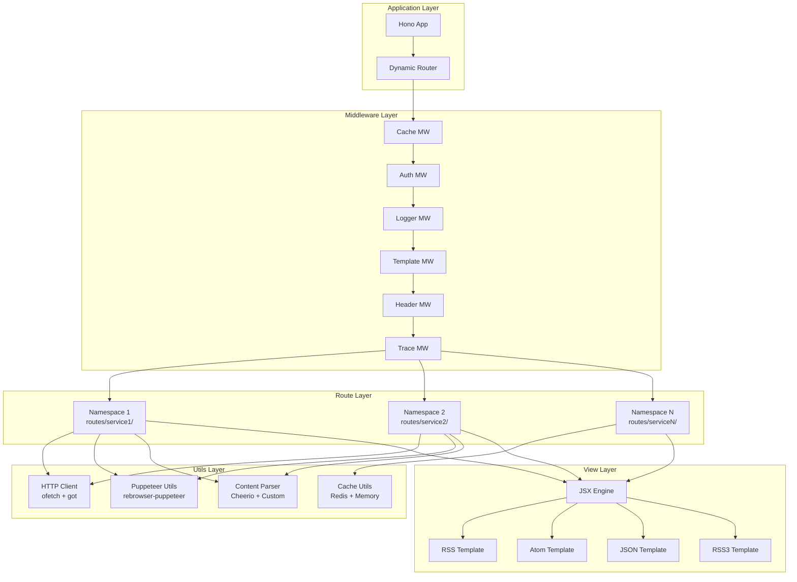
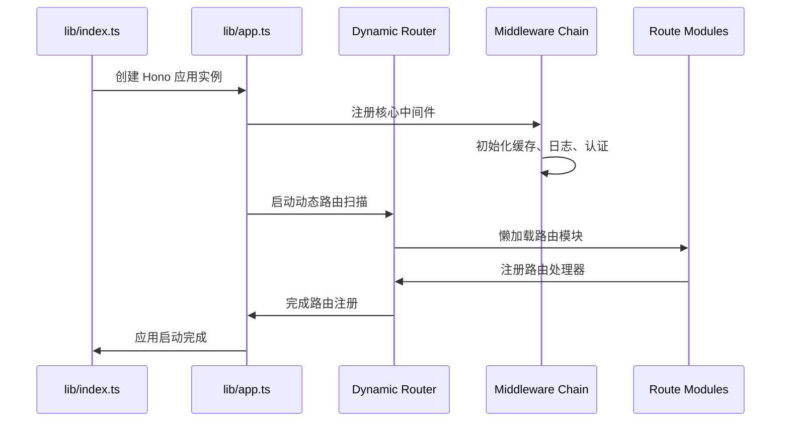
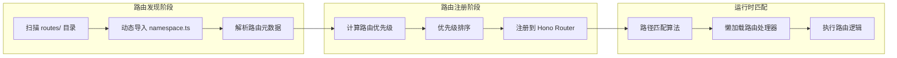
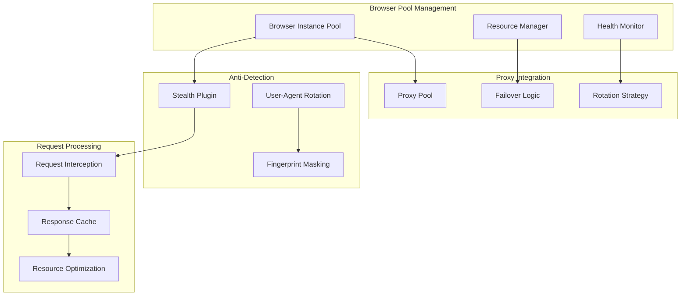
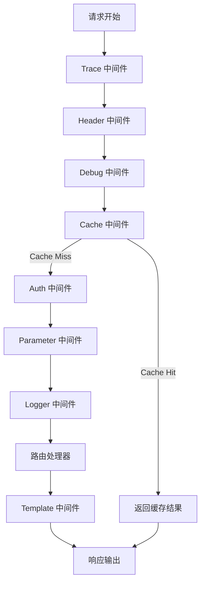
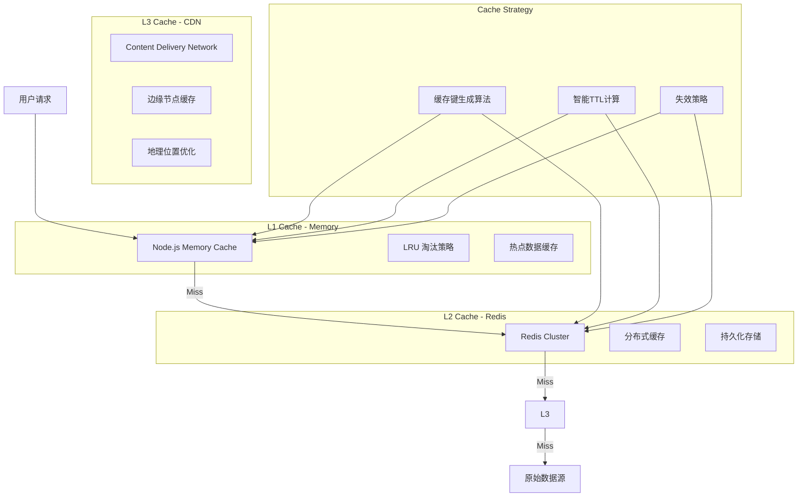
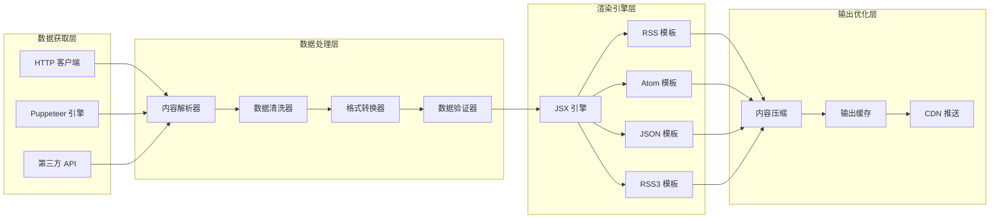
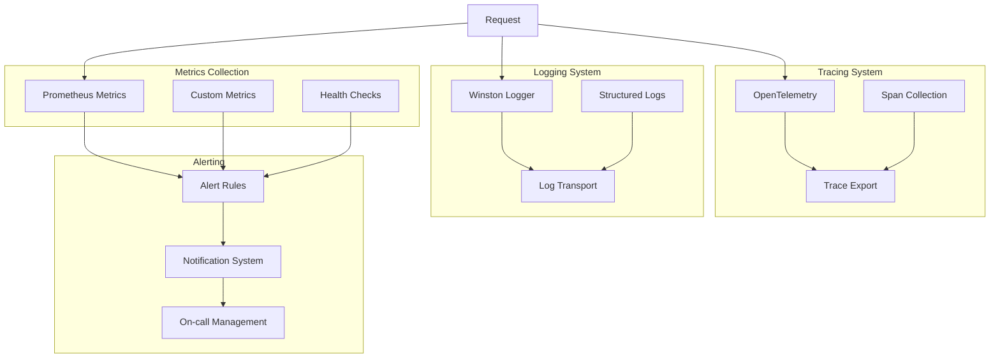

# RSSHub 技术架构文档

> 面向高级开发者的 RSSHub 技术架构深度解析

## 📋 目录

- [系统概览](#系统概览)
- [核心架构](#核心架构)
- [动态路由管理](#动态路由管理)
- [浏览器模拟集成](#浏览器模拟集成)
- [中间件架构](#中间件架构)
- [缓存策略](#缓存策略)
- [数据流与渲染](#数据流与渲染)
- [可观测性](#可观测性)
- [扩展开发](#扩展开发)

## 🏗️ 系统概览

RSSHub 是基于现代 TypeScript 技术栈的高性能 RSS 聚合服务，采用 **Hono + Node.js** 架构，支持 5000+ 源的内容聚合和多种部署模式。

### 技术栈

```
┌─────────────────┐
│   应用层 (App)   │  Hono Web Framework + TypeScript
├─────────────────┤
│  中间件层 (MW)   │  Cache, Auth, Logger, Template
├─────────────────┤
│  路由层 (Route)  │  Dynamic Route System (5000+)
├─────────────────┤
│  工具层 (Utils)  │  HTTP, Puppeteer, Parser, Cache
├─────────────────┤
│  视图层 (View)   │  JSX Template Engine (RSS/Atom/JSON)
└─────────────────┘
```

### 核心设计原则

1. **模块化设计** - 命名空间路由组织，松耦合组件
2. **高性能缓存** - 多层缓存策略，智能失效机制
3. **动态扩展** - 运行时路由注册，热插拔支持
4. **容错设计** - 优雅降级，代理故障转移
5. **可观测性** - 全链路追踪，性能监控

## 🏛️ 核心架构

### 架构层次图



### 应用启动流程



## 🛣️ 动态路由管理

RSSHub 的核心创新在于其动态路由管理系统，支持运行时路由注册和智能优先级排序。

### 路由组织架构

```
lib/routes/
├── {service}/              # 服务命名空间
│   ├── namespace.ts        # 路由元数据配置
│   ├── {route}.ts         # 具体路由实现
│   ├── utils.ts           # 服务工具函数
│   └── types.ts           # 类型定义
```

### 命名空间配置系统

```typescript
// namespace.ts 结构
export const namespace: Namespace = {
    name: 'service-name',
    url: 'https://service.com',
    description: '服务描述',
    lang: 'zh-CN',
    maintainers: ['username'],
    category: 'new-media',
    // 路由元数据
    routes: {
        '/path': {
            path: '/service/path/:param',
            name: '路由名称',
            maintainers: ['username'],
            example: '/service/path/example',
            parameters: {
                param: '参数说明'
            },
            description: '路由功能描述',
            categories: ['category']
        }
    }
};
```

### 动态路由注册机制



### 路由优先级算法

RSSHub 实现智能路由优先级算法，确保最精确的路由匹配：

```typescript
// 路由优先级计算逻辑
function calculateRoutePriority(route: string): number {
    let priority = 0;
    
    // 静态段权重更高
    const staticSegments = route.split('/').filter(segment => 
        !segment.includes(':') && !segment.includes('*')
    );
    priority += staticSegments.length * 100;
    
    // 参数段权重中等
    const paramSegments = route.split('/').filter(segment => 
        segment.includes(':')
    );
    priority += paramSegments.length * 50;
    
    // 通配符权重最低
    const wildcardSegments = route.split('/').filter(segment => 
        segment.includes('*')
    );
    priority += wildcardSegments.length * 10;
    
    return priority;
}
```

### 路由参数处理流程

```typescript
// 路由参数验证和转换管道
const parameterPipeline = [
    validateRequired,    // 必需参数验证
    typeConversion,     // 类型转换
    sanitizeInput,      // 输入清理
    customValidation    // 自定义验证规则
];

export const route: Route = {
    path: '/service/:id/:format?',
    handler: async (ctx) => {
        // 自动参数提取和验证
        const { id, format = 'rss' } = ctx.req.param();
        
        // 参数验证管道
        const validatedParams = await processParameters(
            { id, format }, 
            parameterPipeline
        );
        
        return await handleRoute(validatedParams);
    }
};
```

## 🎭 浏览器模拟集成

RSSHub 集成先进的浏览器自动化解决方案，处理动态内容渲染和反检测需求。

### Puppeteer 集成架构



### rebrowser-puppeteer 选择原因

1. **企业级稳定性** - 基于 Chromium 稳定版本
2. **内置反检测** - 预配置反机器人检测
3. **代理原生支持** - 完整的代理链集成
4. **资源优化** - 自动资源管理和内存控制
5. **云原生设计** - 容器化部署优化

### 浏览器实例管理

```typescript
// 浏览器池管理实现
class BrowserPool {
    private instances: Map<string, Browser> = new Map();
    private readonly maxInstances = 10;
    private readonly idleTimeout = 300000; // 5分钟
    
    async getBrowser(options: BrowserOptions): Promise<Browser> {
        const key = this.generateKey(options);
        
        if (this.instances.has(key)) {
            return this.instances.get(key)!;
        }
        
        if (this.instances.size >= this.maxInstances) {
            await this.releaseIdleBrowser();
        }
        
        const browser = await this.createBrowser(options);
        this.instances.set(key, browser);
        
        // 设置空闲回收
        this.scheduleCleanup(key);
        
        return browser;
    }
    
    private async createBrowser(options: BrowserOptions): Promise<Browser> {
        return await puppeteer.launch({
            headless: true,
            args: [
                '--no-sandbox',
                '--disable-setuid-sandbox',
                '--disable-dev-shm-usage',
                `--proxy-server=${options.proxy}`,
                `--user-agent=${options.userAgent}`
            ],
            ...options
        });
    }
}
```

### 代理管理和故障转移

```typescript
// 代理管理系统
class ProxyManager {
    private proxies: ProxyConfig[] = [];
    private failedProxies: Set<string> = new Set();
    private currentIndex = 0;
    
    async getWorkingProxy(): Promise<ProxyConfig> {
        const maxRetries = this.proxies.length;
        
        for (let i = 0; i < maxRetries; i++) {
            const proxy = this.getNextProxy();
            
            if (this.failedProxies.has(proxy.id)) {
                continue;
            }
            
            if (await this.testProxy(proxy)) {
                return proxy;
            } else {
                this.markProxyFailed(proxy.id);
            }
        }
        
        throw new Error('所有代理均不可用');
    }
    
    private async testProxy(proxy: ProxyConfig): Promise<boolean> {
        try {
            const browser = await puppeteer.launch({
                args: [`--proxy-server=${proxy.url}`]
            });
            
            const page = await browser.newPage();
            await page.goto('https://httpbin.org/ip', { timeout: 10000 });
            await browser.close();
            
            return true;
        } catch {
            return false;
        }
    }
}
```

## 🔄 中间件架构

RSSHub 基于 Hono 的中间件系统构建了强大的请求处理管道。

### 中间件执行链



### 核心中间件实现

#### 缓存中间件

```typescript
// 智能缓存中间件
export const cacheMiddleware = (): MiddlewareHandler => {
    return async (ctx, next) => {
        const cacheKey = generateCacheKey(ctx);
        const cached = await cache.get(cacheKey);
        
        if (cached && !isCacheExpired(cached)) {
            // 缓存命中，直接返回
            ctx.header('X-Cache-Status', 'HIT');
            return ctx.json(cached.data);
        }
        
        // 缓存未命中，继续处理
        await next();
        
        // 缓存响应数据
        if (ctx.res.ok) {
            const responseData = await ctx.res.clone().json();
            await cache.set(cacheKey, {
                data: responseData,
                timestamp: Date.now(),
                ttl: calculateTTL(ctx)
            });
            
            ctx.header('X-Cache-Status', 'MISS');
        }
    };
};
```

#### 认证中间件

```typescript
// 统一认证中间件
export const authMiddleware = (): MiddlewareHandler => {
    return async (ctx, next) => {
        const route = ctx.req.path;
        const config = getRouteConfig(route);
        
        if (config.requiresAuth) {
            const authResult = await validateAuthentication(ctx);
            
            if (!authResult.valid) {
                return ctx.json({
                    error: 'Authentication required',
                    code: 401
                }, 401);
            }
            
            // 注入认证信息到上下文
            ctx.set('auth', authResult.data);
        }
        
        await next();
    };
};
```

#### 模板中间件

```typescript
// JSX 模板渲染中间件
export const templateMiddleware = (): MiddlewareHandler => {
    return async (ctx, next) => {
        await next();
        
        // 检查是否需要模板渲染
        if (!ctx.get('skipTemplate')) {
            const format = ctx.req.query('format') || 'rss';
            const data = ctx.get('feedData');
            
            if (data) {
                const rendered = await renderTemplate(format, data);
                ctx.header('Content-Type', getContentType(format));
                return ctx.body(rendered);
            }
        }
    };
};
```

### 中间件扩展机制

```typescript
// 中间件注册系统
class MiddlewareManager {
    private middlewares: Map<string, MiddlewareHandler> = new Map();
    private beforeHooks: Map<string, Hook[]> = new Map();
    private afterHooks: Map<string, Hook[]> = new Map();
    
    register(name: string, middleware: MiddlewareHandler) {
        this.middlewares.set(name, middleware);
    }
    
    addBeforeHook(middlewareName: string, hook: Hook) {
        const hooks = this.beforeHooks.get(middlewareName) || [];
        hooks.push(hook);
        this.beforeHooks.set(middlewareName, hooks);
    }
    
    async execute(ctx: Context, middlewareName: string) {
        // 执行前置钩子
        const beforeHooks = this.beforeHooks.get(middlewareName) || [];
        for (const hook of beforeHooks) {
            await hook(ctx);
        }
        
        // 执行中间件
        const middleware = this.middlewares.get(middlewareName);
        if (middleware) {
            await middleware(ctx, async () => {});
        }
        
        // 执行后置钩子
        const afterHooks = this.afterHooks.get(middlewareName) || [];
        for (const hook of afterHooks) {
            await hook(ctx);
        }
    }
}
```

## 💾 缓存策略

RSSHub 实现了多层缓存架构，确保最佳性能和资源利用。

### 缓存层次架构



### 缓存键生成算法

RSSHub 使用 XXH64 哈希算法生成高性能缓存键：

```typescript
// 缓存键生成策略
function generateCacheKey(ctx: Context): string {
    const components = [
        ctx.req.path,                    // 请求路径
        JSON.stringify(ctx.req.query()), // 查询参数
        ctx.req.header('user-agent'),    // 用户代理
        ctx.get('authToken') || 'anonymous' // 认证标识
    ];
    
    const keyString = components.join('|');
    return `rsshub:${xxhash.h64(keyString, 0).toString(16)}`;
}

// 智能 TTL 计算
function calculateTTL(ctx: Context): number {
    const route = ctx.req.path;
    const config = getRouteConfig(route);
    
    // 基础 TTL
    let ttl = config.cacheTTL || 3600; // 默认1小时
    
    // 根据数据更新频率调整
    if (config.updateFrequency === 'high') {
        ttl = Math.min(ttl, 600); // 最多10分钟
    } else if (config.updateFrequency === 'low') {
        ttl = Math.max(ttl, 7200); // 最少2小时
    }
    
    // 根据负载情况调整
    const currentLoad = getCurrentSystemLoad();
    if (currentLoad > 0.8) {
        ttl *= 1.5; // 高负载时延长缓存时间
    }
    
    return ttl;
}
```

### 请求去重和并发控制

```typescript
// 请求去重管理器
class RequestDeduplicator {
    private inProgress: Map<string, Promise<any>> = new Map();
    private readonly timeout = 30000; // 30秒超时
    
    async execute<T>(key: string, fn: () => Promise<T>): Promise<T> {
        // 检查是否有相同请求正在处理
        if (this.inProgress.has(key)) {
            return await this.inProgress.get(key)!;
        }
        
        // 创建新请求 Promise
        const promise = this.createTimedPromise(fn);
        this.inProgress.set(key, promise);
        
        try {
            const result = await promise;
            return result;
        } finally {
            // 清理已完成的请求
            this.inProgress.delete(key);
        }
    }
    
    private createTimedPromise<T>(fn: () => Promise<T>): Promise<T> {
        return Promise.race([
            fn(),
            new Promise<never>((_, reject) => {
                setTimeout(() => reject(new Error('Request timeout')), this.timeout);
            })
        ]);
    }
}
```

### 缓存预热和失效策略

```typescript
// 缓存预热系统
class CacheWarmer {
    private warmupRoutes: string[] = [];
    private schedule: NodeJS.Timeout | null = null;
    
    startWarmup() {
        // 每10分钟执行一次预热
        this.schedule = setInterval(async () => {
            await this.performWarmup();
        }, 600000);
    }
    
    private async performWarmup() {
        const popularRoutes = await this.getPopularRoutes();
        
        for (const route of popularRoutes) {
            try {
                // 异步预热，不阻塞主流程
                this.warmupRoute(route).catch(error => {
                    logger.warn(`预热失败: ${route}`, error);
                });
            } catch (error) {
                // 忽略预热错误，不影响主要功能
            }
        }
    }
    
    private async warmupRoute(route: string) {
        const cacheKey = generateCacheKey({ req: { path: route } } as any);
        const cached = await cache.get(cacheKey);
        
        if (!cached || this.shouldRefresh(cached)) {
            // 执行预热请求
            await this.executeRouteHandler(route);
        }
    }
}
```

## 📊 数据流与渲染

RSSHub 实现了高效的数据处理管道和多格式渲染引擎。

### 数据流架构



### JSX 渲染引擎

RSSHub 使用自定义 JSX 引擎实现高性能模板渲染：

```typescript
// JSX 渲染核心实现
class JSXRenderer {
    private templateCache: Map<string, CompiledTemplate> = new Map();
    
    async render(format: string, data: FeedData): Promise<string> {
        const template = await this.getCompiledTemplate(format);
        return await template.render(data);
    }
    
    private async getCompiledTemplate(format: string): Promise<CompiledTemplate> {
        if (this.templateCache.has(format)) {
            return this.templateCache.get(format)!;
        }
        
        const templateComponent = await this.loadTemplate(format);
        const compiled = this.compileTemplate(templateComponent);
        
        this.templateCache.set(format, compiled);
        return compiled;
    }
    
    private compileTemplate(component: React.ComponentType): CompiledTemplate {
        return {
            render: async (data: FeedData) => {
                const element = React.createElement(component, data);
                return await renderToString(element);
            }
        };
    }
}
```

### RSS 模板实现

```typescript
// RSS 模板组件
export const RSSTemplate: React.FC<FeedData> = ({ 
    title, 
    description, 
    link, 
    items, 
    language = 'zh-CN',
    pubDate,
    lastBuildDate = new Date().toUTCString(),
    ttl,
    image
}) => {
    return (
        <rss version="2.0" 
             xmlns:content="http://purl.org/rss/1.0/modules/content/"
             xmlns:atom="http://www.w3.org/2005/Atom">
            <channel>
                <title>{title}</title>
                <description>{description}</description>
                <link>{link}</link>
                <language>{language}</language>
                <pubDate>{pubDate}</pubDate>
                <lastBuildDate>{lastBuildDate}</lastBuildDate>
                {ttl && <ttl>{ttl}</ttl>}
                {image && (
                    <image>
                        <url>{image.url}</url>
                        <title>{image.title}</title>
                        <link>{image.link}</link>
                    </image>
                )}
                <atom:link href={`${link}/rss`} rel="self" type="application/rss+xml" />
                
                {items.map((item, index) => (
                    <item key={index}>
                        <title>{item.title}</title>
                        <description>{item.description}</description>
                        <link>{item.link}</link>
                        <guid isPermaLink="false">{item.guid || item.link}</guid>
                        <pubDate>{item.pubDate}</pubDate>
                        {item.author && <author>{item.author}</author>}
                        {item.category && <category>{item.category}</category>}
                        {item.content && (
                            <content:encoded>{`<![CDATA[${item.content}]]>`}</content:encoded>
                        )}
                        {item.enclosure && (
                            <enclosure 
                                url={item.enclosure.url}
                                length={item.enclosure.length || '0'}
                                type={item.enclosure.type || 'application/octet-stream'}
                            />
                        )}
                    </item>
                ))}
            </channel>
        </rss>
    );
};
```

### 多格式输出支持

```typescript
// 格式路由器
class FormatRouter {
    private formatHandlers: Map<string, FormatHandler> = new Map();
    
    constructor() {
        this.registerDefaultFormats();
    }
    
    private registerDefaultFormats() {
        this.formatHandlers.set('rss', {
            contentType: 'application/rss+xml; charset=utf-8',
            template: RSSTemplate,
            validator: validateRSS
        });
        
        this.formatHandlers.set('atom', {
            contentType: 'application/atom+xml; charset=utf-8',
            template: AtomTemplate,
            validator: validateAtom
        });
        
        this.formatHandlers.set('json', {
            contentType: 'application/json; charset=utf-8',
            template: JSONTemplate,
            validator: validateJSON
        });
        
        this.formatHandlers.set('rss3', {
            contentType: 'application/json; charset=utf-8',
            template: RSS3Template,
            validator: validateRSS3
        });
    }
    
    async render(format: string, data: FeedData): Promise<RenderResult> {
        const handler = this.formatHandlers.get(format);
        if (!handler) {
            throw new Error(`不支持的格式: ${format}`);
        }
        
        // 数据验证
        const validatedData = await handler.validator(data);
        
        // 模板渲染
        const content = await this.renderTemplate(handler.template, validatedData);
        
        return {
            content,
            contentType: handler.contentType,
            headers: this.generateHeaders(format, validatedData)
        };
    }
}
```

### 内容清洗and优化

```typescript
// 内容清洗处理器
class ContentSanitizer {
    private cleaningRules: CleaningRule[] = [
        // 移除恶意脚本
        {
            pattern: /<script\b[^<]*(?:(?!<\/script>)<[^<]*)*<\/script>/gi,
            replacement: ''
        },
        // 清理样式标签
        {
            pattern: /<style\b[^<]*(?:(?!<\/style>)<[^<]*)*<\/style>/gi,
            replacement: ''
        },
        // 标准化链接
        {
            pattern: /href=["']([^"']*)["']/gi,
            replacement: (match, url) => `href="${this.normalizeUrl(url)}"`
        }
    ];
    
    async sanitize(content: string): Promise<string> {
        let cleanContent = content;
        
        for (const rule of this.cleaningRules) {
            if (typeof rule.replacement === 'function') {
                cleanContent = cleanContent.replace(rule.pattern, rule.replacement);
            } else {
                cleanContent = cleanContent.replace(rule.pattern, rule.replacement);
            }
        }
        
        // 使用 DOMPurify 进行最终清理
        return this.deepSanitize(cleanContent);
    }
    
    private normalizeUrl(url: string): string {
        try {
            return new URL(url).toString();
        } catch {
            return url; // 保持原样如果不是有效URL
        }
    }
}
```

## 📈 可观测性

RSSHub 集成 OpenTelemetry 和自定义监控系统，提供全链路可观测性。

### 监控架构



### 性能指标收集

```typescript
// 自定义指标收集器
class MetricsCollector {
    private prometheus = require('prom-client');
    private metrics: Map<string, any> = new Map();
    
    constructor() {
        this.initializeMetrics();
    }
    
    private initializeMetrics() {
        // 请求计数器
        this.metrics.set('requests_total', new this.prometheus.Counter({
            name: 'rsshub_requests_total',
            help: 'Total number of requests',
            labelNames: ['route', 'method', 'status_code']
        }));
        
        // 响应时间直方图
        this.metrics.set('request_duration', new this.prometheus.Histogram({
            name: 'rsshub_request_duration_seconds',
            help: 'Request duration in seconds',
            labelNames: ['route', 'method'],
            buckets: [0.1, 0.5, 1, 2, 5, 10, 30]
        }));
        
        // 缓存命中率
        this.metrics.set('cache_hit_rate', new this.prometheus.Gauge({
            name: 'rsshub_cache_hit_rate',
            help: 'Cache hit rate percentage',
            labelNames: ['cache_type']
        }));
        
        // 活跃连接数
        this.metrics.set('active_connections', new this.prometheus.Gauge({
            name: 'rsshub_active_connections',
            help: 'Number of active connections',
            labelNames: ['type']
        }));
    }
    
    recordRequest(route: string, method: string, statusCode: number, duration: number) {
        this.metrics.get('requests_total').inc({
            route,
            method,
            status_code: statusCode.toString()
        });
        
        this.metrics.get('request_duration').observe({
            route,
            method
        }, duration);
    }
}
```

### 分布式追踪

```typescript
// OpenTelemetry 集成
import { trace, context, SpanStatusCode } from '@opentelemetry/api';

class TracingManager {
    private tracer = trace.getTracer('rsshub', '1.0.0');
    
    async traceRoute(routeName: string, handler: () => Promise<any>): Promise<any> {
        const span = this.tracer.startSpan(`route.${routeName}`);
        
        try {
            // 设置 span 属性
            span.setAttributes({
                'route.name': routeName,
                'service.name': 'rsshub',
                'service.version': process.env.npm_package_version || '1.0.0'
            });
            
            // 在 span 上下文中执行处理器
            const result = await context.with(trace.setSpan(context.active(), span), handler);
            
            span.setStatus({ code: SpanStatusCode.OK });
            return result;
            
        } catch (error) {
            span.setStatus({
                code: SpanStatusCode.ERROR,
                message: error.message
            });
            
            span.recordException(error);
            throw error;
            
        } finally {
            span.end();
        }
    }
    
    createChildSpan(operation: string): any {
        return this.tracer.startSpan(operation, {
            parent: trace.getActiveSpan()
        });
    }
}
```

### 健康检查系统

```typescript
// 健康检查管理器
class HealthCheckManager {
    private checks: Map<string, HealthCheck> = new Map();
    private interval: NodeJS.Timeout | null = null;
    
    registerCheck(name: string, check: HealthCheck) {
        this.checks.set(name, check);
    }
    
    startHealthChecks() {
        this.interval = setInterval(async () => {
            await this.performHealthChecks();
        }, 30000); // 30秒检查一次
    }
    
    private async performHealthChecks() {
        const results: HealthCheckResult[] = [];
        
        for (const [name, check] of this.checks) {
            try {
                const result = await this.executeCheck(name, check);
                results.push(result);
            } catch (error) {
                results.push({
                    name,
                    status: 'unhealthy',
                    error: error.message,
                    timestamp: new Date().toISOString()
                });
            }
        }
        
        // 更新健康状态
        await this.updateHealthStatus(results);
    }
    
    private async executeCheck(name: string, check: HealthCheck): Promise<HealthCheckResult> {
        const startTime = Date.now();
        const result = await check.execute();
        const duration = Date.now() - startTime;
        
        return {
            name,
            status: result.healthy ? 'healthy' : 'unhealthy',
            duration,
            details: result.details,
            timestamp: new Date().toISOString()
        };
    }
}

// 预定义健康检查
const databaseHealthCheck: HealthCheck = {
    execute: async () => {
        try {
            await redis.ping();
            return { healthy: true, details: 'Redis connection OK' };
        } catch (error) {
            return { healthy: false, details: error.message };
        }
    }
};

const memoryHealthCheck: HealthCheck = {
    execute: async () => {
        const usage = process.memoryUsage();
        const heapUsedMB = usage.heapUsed / 1024 / 1024;
        const threshold = 1000; // 1GB
        
        return {
            healthy: heapUsedMB < threshold,
            details: `Heap usage: ${heapUsedMB.toFixed(2)}MB`
        };
    }
};
```

## 🔧 扩展开发

### 新路由开发指南

#### 1. 创建路由命名空间

```bash
mkdir lib/routes/your-service
cd lib/routes/your-service
```

#### 2. 定义命名空间配置

```typescript
// namespace.ts
import type { Namespace } from '@/types';

export const namespace: Namespace = {
    name: 'your-service',
    url: 'https://your-service.com',
    description: '服务描述',
    lang: 'zh-CN',
    maintainers: ['your-username']
};
```

#### 3. 实现路由处理器

```typescript
// your-route.ts
import { Route } from '@/types';
import { getCurrentPath } from '@/utils/helpers';
import got from '@/utils/got';
import { parseDate } from '@/utils/parse-date';

export const route: Route = {
    path: '/your-service/path/:param',
    categories: ['new-media'],
    example: '/your-service/path/example',
    parameters: {
        param: '参数说明'
    },
    features: {
        requireConfig: false,
        requirePuppeteer: false,
        antiCrawler: false,
        supportBT: false,
        supportPodcast: false,
        supportScihub: false
    },
    radar: [
        {
            source: ['your-service.com/path/:param'],
            target: '/your-service/path/:param'
        }
    ],
    name: '路由名称',
    maintainers: ['your-username'],
    handler: async (ctx) => {
        const { param } = ctx.req.param();
        
        // 数据获取
        const response = await got('https://api.your-service.com/data', {
            searchParams: {
                param
            }
        });
        
        const data = response.data;
        
        // 数据处理
        const items = data.items.map(item => ({
            title: item.title,
            link: item.url,
            description: item.summary,
            pubDate: parseDate(item.published_at),
            author: item.author,
            category: item.tags
        }));
        
        return {
            title: `${data.title} - Your Service`,
            link: `https://your-service.com/path/${param}`,
            description: data.description,
            item: items
        };
    }
};
```

#### 4. 添加测试用例

```typescript
// your-route.test.ts
import { describe, expect, it } from 'vitest';
import { runTest } from '@/utils/helpers';

describe('Your Service', () => {
    it('should work', async () => {
        const { data } = await runTest({
            handler: route.handler,
            path: '/your-service/path/test'
        });
        
        expect(data.title).toBeTruthy();
        expect(data.item).toHaveLength.greaterThan(0);
        expect(data.item[0]).toHaveProperty('title');
        expect(data.item[0]).toHaveProperty('link');
    });
});
```

### 中间件开发

```typescript
// 自定义中间件开发模板
export const customMiddleware = (options: MiddlewareOptions = {}): MiddlewareHandler => {
    return async (ctx, next) => {
        const startTime = Date.now();
        
        try {
            // 前置处理
            await preprocessRequest(ctx, options);
            
            // 继续执行后续中间件
            await next();
            
            // 后置处理
            await postprocessResponse(ctx, options);
            
        } catch (error) {
            // 错误处理
            await handleError(ctx, error, options);
            throw error;
            
        } finally {
            // 清理资源
            const duration = Date.now() - startTime;
            recordMetrics(ctx, duration);
        }
    };
};

async function preprocessRequest(ctx: Context, options: MiddlewareOptions) {
    // 请求预处理逻辑
    if (options.validateInput) {
        await validateRequestInput(ctx);
    }
    
    if (options.enrichContext) {
        await enrichRequestContext(ctx);
    }
}

async function postprocessResponse(ctx: Context, options: MiddlewareOptions) {
    // 响应后处理逻辑
    if (options.transformOutput) {
        await transformResponseOutput(ctx);
    }
    
    if (options.addHeaders) {
        addResponseHeaders(ctx, options.headers);
    }
}
```

### 工具函数开发

```typescript
// 工具函数开发模板
import { load } from 'cheerio';
import type { CheerioAPI } from 'cheerio';

export interface ParseOptions {
    baseUrl?: string;
    dateFormat?: string;
    encoding?: string;
}

export class ContentParser {
    private $: CheerioAPI;
    private options: ParseOptions;
    
    constructor(html: string, options: ParseOptions = {}) {
        this.$ = load(html);
        this.options = {
            encoding: 'utf8',
            dateFormat: 'YYYY-MM-DD',
            ...options
        };
    }
    
    parseItems(selector: string): ParsedItem[] {
        const items: ParsedItem[] = [];
        
        this.$(selector).each((_, element) => {
            const $element = this.$(element);
            const item = this.parseItem($element);
            
            if (item) {
                items.push(item);
            }
        });
        
        return items;
    }
    
    private parseItem($element: any): ParsedItem | null {
        try {
            const title = this.extractText($element, '.title');
            const link = this.extractLink($element, '.link');
            const description = this.extractText($element, '.description');
            const pubDate = this.extractDate($element, '.date');
            
            if (!title || !link) {
                return null;
            }
            
            return {
                title: title.trim(),
                link: this.resolveUrl(link),
                description: description?.trim() || '',
                pubDate
            };
            
        } catch (error) {
            console.warn('解析项目失败:', error);
            return null;
        }
    }
    
    private extractText($element: any, selector: string): string | null {
        const element = $element.find(selector).first();
        return element.length > 0 ? element.text() : null;
    }
    
    private extractLink($element: any, selector: string): string | null {
        const element = $element.find(selector).first();
        return element.length > 0 ? element.attr('href') : null;
    }
    
    private extractDate($element: any, selector: string): Date | null {
        const dateText = this.extractText($element, selector);
        if (!dateText) return null;
        
        const date = new Date(dateText);
        return isNaN(date.getTime()) ? null : date;
    }
    
    private resolveUrl(url: string): string {
        if (!url) return '';
        
        if (url.startsWith('http')) {
            return url;
        }
        
        if (this.options.baseUrl) {
            return new URL(url, this.options.baseUrl).toString();
        }
        
        return url;
    }
}

// 使用示例
export function parseServiceContent(html: string, baseUrl: string): ParsedItem[] {
    const parser = new ContentParser(html, { baseUrl });
    return parser.parseItems('.item');
}
```

---

## 🎯 总结

RSSHub 采用现代化的技术架构，通过模块化设计、智能缓存、动态路由和全链路监控，构建了高性能、可扩展的 RSS 聚合服务。其核心优势包括：

1. **高性能架构** - Hono + TypeScript + 多层缓存
2. **动态扩展** - 运行时路由注册和插件系统
3. **智能优化** - 自适应缓存策略和资源管理
4. **全链路监控** - OpenTelemetry 集成和自定义指标
5. **开发友好** - 完整的开发工具链和扩展机制

通过深入理解这些架构设计，开发者可以更好地参与 RSSHub 的开发和扩展，构建更加强大和高效的内容聚合解决方案。

---

<details>
<summary>📚 扩展阅读</summary>

- [Hono 官方文档](https://hono.dev/)
- [OpenTelemetry JavaScript](https://opentelemetry.io/docs/instrumentation/js/)
- [Puppeteer 指南](https://pptr.dev/)
- [Redis 缓存策略](https://redis.io/docs/manual/config/)
- [JSX 服务端渲染](https://react.dev/reference/react-dom/server)

</details>